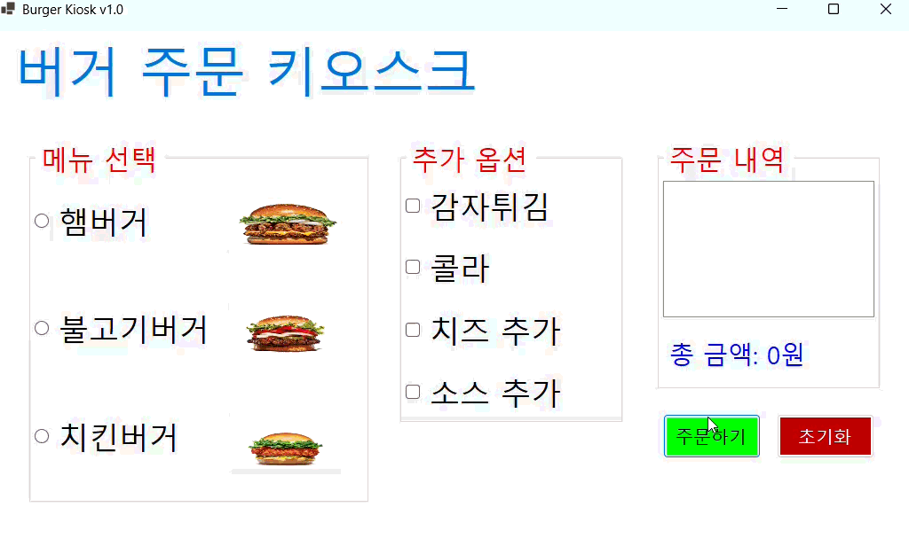
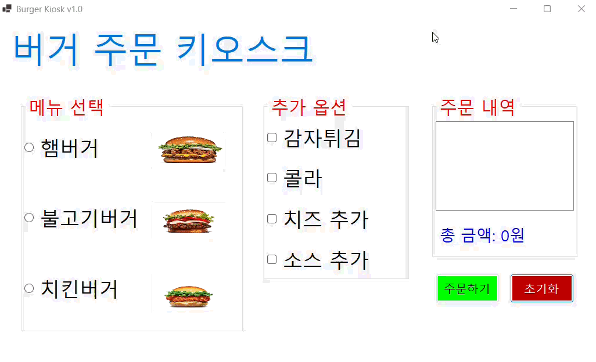
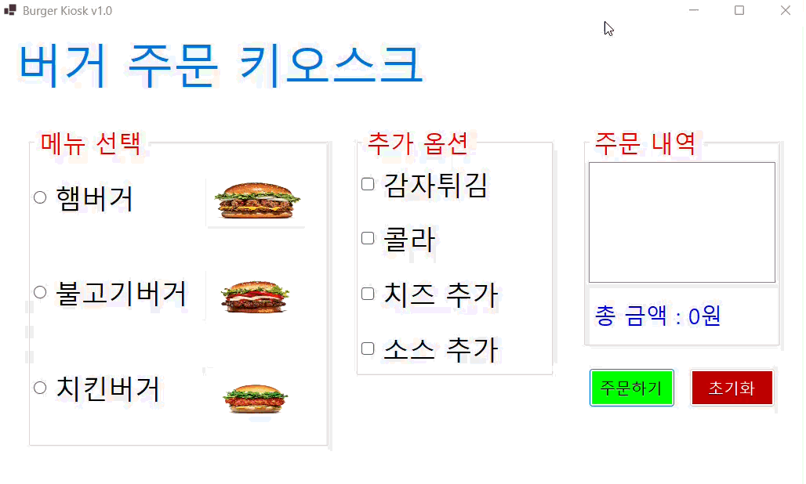
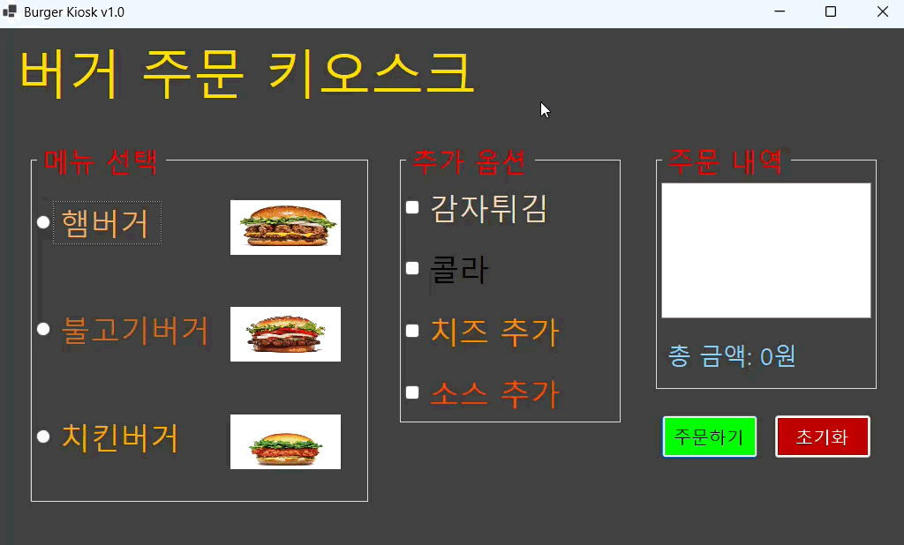

# (C# 코딩) BurgerKiosk
- **이름**: 김재서 (23010114)
- **학과**: 컴퓨터SW학과

---

## 개요
- C# 프로그래밍 학습
- 1줄 소개: 햄버거 및 추가 옵션 선택 키오스크
- 사용한 플랫폼: 
	- C#, .NET Windows Forms, Visual Studio, GitHub
- 사용한 컨트롤: 
	

- 사용한 기술과 구현한 기능: 
	

---

## 📸 단계별 실행 화면

## 실행 화면 (과제1)
- 과제1 코드의 실행 스크린샷

- 과제 내용:
	- 키오스크 기본 UI 구성: 라디오 버튼(메뉴 선택), 체크박스(옵션 선택), 리스트박스(주문 내역), 버튼(주문/초기화) 등을 배치하여 표준적인 키오스크 화면을 설계합니다.
	- 주문 합산 로직 구현: 사용자가 선택한 메뉴와 옵션의 가격을 실시간으로 계산하여 총 금액을 산출하는 기능을 구현합니다.
	- 데이터 초기화: '초기화' 버튼을 통해 모든 선택 사항과 결제 금액을 0으로 되돌리는 기능을 구축합니다.

- 구현 내용과 기능 설명:
	- 컨트롤 그룹화: GroupBox를 사용하여 '메뉴 선택'과 '추가 옵션' 영역을 시각적으로 분리하여 사용자 혼선을 방지했습니다.
	- 실시간 리스트박스 업데이트: '주문하기' 버튼 클릭 시 선택된 항목들을 lstOrder에 순차적으로 출력하여 영수증과 같은 효과를 주었습니다.
	- 세 자리 콤마 포맷팅: totalCost.ToString("N0")을 적용하여 큰 금액도 한눈에 읽기 쉽도록 구현하였습니다.

- 사용한 기술과 구현한 기능:
	- 기본 컨트롤 활용: RadioButton, CheckBox, ListBox, Button의 핵심 속성 제어
	- 금액 합산 알고리즘: 전역 변수를 활용한 누적 계산 및 btnOrder_Click 시 totalCost = 0 초기화 후 재계산 로직 적용
	

---

## 실행 화면 (과제2)
- 과제2 코드의 실행 스크린샷

- 과제 내용:
	- 

- 구현 내용과 기능 설명:
	- 

- 사용한 기술과 구현한 기능:
	- 

---

## 실행 화면 (과제3)
- 과제3 코드의 실행 스크린샷

- 과제 내용:
	- 

- 구현 내용과 기능 설명:
	- 

- 사용한 기술과 구현한 기능:
	- 

---

## 실행 화면 (과제4)
- 과제4 코드의 실행 스크린샷

- 과제 내용:
	- 

- 구현 내용과 기능 설명:
	- 

- 사용한 기술과 구현한 기능:
	- 